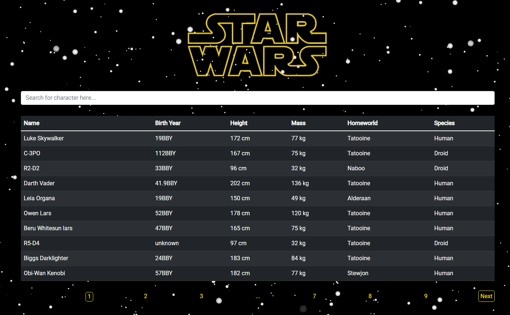

# Star Wars Search Application

A React application that fetches data from the Star Wars API (SWAPI) and displays all the chracters from the Star Wars universe in a table. 

Access it [here](https://star-wars-app-rd.herokuapp.com/)

## Description

This application uses the Star Wars API (SWAPI) to display Star Wars characters and a few of their attributes. The application has two main functionalities. The first  is to display a table of Star Wars characters, up to ten at a time. The second allows you to search up characters by their attributes.

I used react to build this application by combining multiple components together. Bootstrap was used to do basic styling. I used fetch to get information from SWAPI (https://swapi.dev/) and displayed it on screen. In future I could revisit this project and further improve the styling as I mainly focused on functionality this time around. I also may try using axios for fetching information. I was already part way through building this project when I realized that was a tool I could utilize.

## Updates - 12/09/2022

1. I'm used the axios libary to fetch data from the Star Wars API and also use async and await instead of chaining the .then() method. The application now fetches all the character data at once instead of fetching 10 characters at a time. This way data is only fetched when the application is rendered versus before it would have to fetch every time you clicked on next page. 

2. I totally changed the pagination functionality. In the first iteration of this project, I created the pagination functionality myself. This time around I'm using the react-paginate library. It's much more simple and it also includes page numbers at the bottom so you can jump directly to the page you're looking for. 

3. In the first version of the search function, the application would fetch data for one character depending on the search. I've now changed it to a filter function so the table will display one or multiple characters depending on what the search value is. 

4. I've updated the styling to more closely match the Star Wars theme. I also included a background-image and added the Star Wars Logo.

## Installation Instructions

1. Run 'npm i --prefix 'star-wars-search' in the terminal (from the root directory)
2. Run 'npm run start --prefix 'star-wars-search' (from the root directory)

## Author

Raymond Dang - Full-Stack Software Developer - [Website](https://raymondquocdang.com/) | [LinkedIn](https://www.linkedin.com/in/raymond-quoc-dang/)